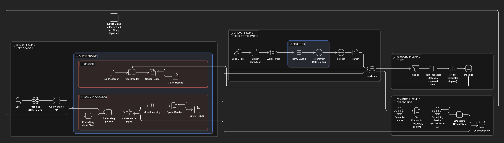

# DeiSearch

A multi-stage search system that crawls English web pages, builds a TF-IDF index, generates semantic embeddings, and serves both keyword and semantic search through a Go API with a React frontend.

## Architecture



**Flow:** Frontend -> Query Engine -> Keyword Search (`index.db` + `spider.db`) / Semantic Search (`embeddings.db` + HNSW + Embedding Service)

**Pipelines:**

- **Crawl Pipeline**: `spider/` -> `spider.db`
- **Keyword Index Pipeline**: `spider.db` -> `indexer/` -> `index.db`
- **Semantic Index Pipeline**: `spider.db` -> `semantic-indexer/` + `embedding-service/` -> `embeddings.db`
- **Query Pipeline**: `frontend/` -> `query-engine/` -> `/search` or `/semantic-search`

**Components:**

- **Spider**: Concurrent crawler that fetches pages, extracts content, and stores pages plus link graph in `spider.db`
- **Indexer**: Two-pass TF-IDF indexer that converts crawled pages into searchable terms and postings in `index.db`
- **Embedding Service**: Python microservice that turns text into normalized 384-dimensional embeddings using `all-MiniLM-L6-v2`
- **Semantic Indexer**: Batch job that reads pages from `spider.db`, embeds them, and stores serialized vectors in `embeddings.db`
- **Query Engine**: Go HTTP API that serves classic keyword search and semantic vector search
- **Frontend**: React + Vite UI that sends user queries to the query engine and renders paginated results

## Services and Databases

- **Frontend**: `frontend/` (default dev server on Vite)
- **Query Engine**: `query-engine/` (`http://localhost:8080`)
- **Embedding Service**: `embedding-service/` (`http://127.0.0.1:5000`)
- **Crawler Database**: `spider.db`
- **Keyword Index Database**: `index.db`
- **Semantic Embeddings Database**: `embeddings.db`

## Example Query

Same query: `how to design database from scratch`

**Keyword Search (`/search`)**


Keyword search overweights literal token overlap, so it can surface results like `Scratch (programming language)` because of the word `scratch` even when the user intent is about databases.

**Semantic Search (`/semantic-search`)**


Semantic search retrieves conceptually related database resources, which better matches the natural-language intent of the query.

## Usage

```bash
# 1. Start the embedding service (needed for semantic indexing and semantic search)
cd embedding-service
python3 -m venv venv
source venv/bin/activate
pip install -r requirements.txt
python server.py

# 2. Build semantic embeddings (one-time / resumable batch job)
cd ../semantic-indexer
go run main.go

# 3. Start the query API
cd ../query-engine
go run main.go

# 4. Start the frontend
cd ../frontend
npm install
npm run dev
```

The system can serve classic keyword search with only `query-engine/` running. Semantic search additionally requires the embedding service and a populated `embeddings.db`.
