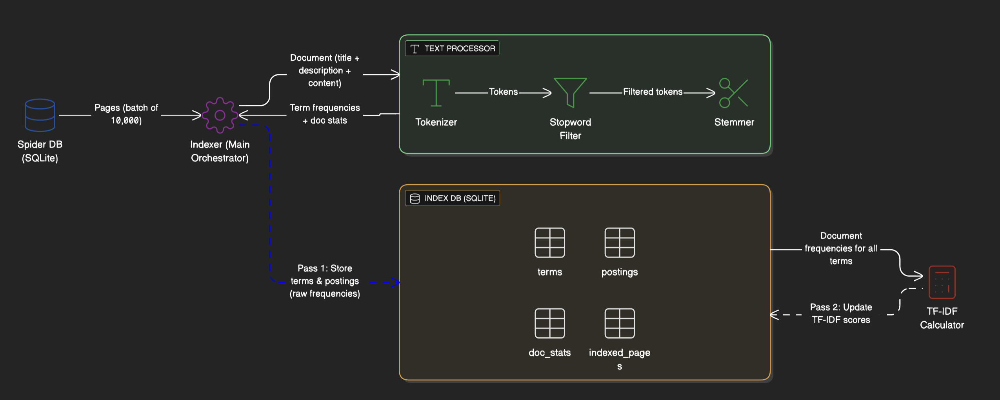

# Indexer

A two-pass TF-IDF indexer built in Go that processes crawled web pages into a searchable inverted index with batch processing and resumable indexing.

## Architecture



**Flow:** Spider DB -> Indexer -> Text Processor (Tokenizer + Stemmer) -> Index DB (2-Pass: Raw Data -> TF-IDF Calculation)

**Components:**

- **Indexer**: Orchestrates batch processing and manages database transactions
- **Spider DB Reader**: Reads crawled pages from the spider's SQLite database
- **Text Processor**: Tokenizes text, removes stopwords, and applies Porter stemming
- **Index DB Writer**: Stores terms, postings, and document statistics in SQLite
- **TF-IDF Calculator**: Two-pass algorithm for computing term importance scores

## Usage

```bash
go run main.go
```

The indexer reads pages from the spider database, processes them in batches, and creates an inverted index. It automatically resumes from the last indexed page ID if interrupted. Use Ctrl+C for graceful shutdown.

## How It Works

**Indexing Strategy:**

- **Pass 1**: Processes all documents in batches, extracting terms and building the inverted index with raw term frequencies
- **Pass 2**: Calculates TF-IDF scores using document frequency statistics across the entire corpus
- Resumable indexing using `last_indexed_page_id` tracking
- Batch processing with database transactions for performance
- Text processing pipeline: Tokenization → Stopword removal → Porter stemming

**TF-IDF Calculation:**

Each term gets a score based on:

- **TF (Term Frequency)**: How often the term appears in the document, normalized by document length: `tf = term_frequency / doc_length`
- **IDF (Inverse Document Frequency)**: How rare the term is across all documents: `idf = log(total_docs / doc_frequency)`
- **TF-IDF**: The product of TF and IDF: `tfidf = tf * idf`

## Database Schema

**terms:**

- term_id (primary key), term (unique), document_frequency, idf

**postings:**

- term_id, doc_id (composite primary key), term_frequency, tf, tfidf
- Composite index on (term_id, tfidf DESC, doc_id) for fast ranked retrieval

**doc_stats:**

- doc_id (primary key), doc_length, unique_terms, indexed_at

**indexed_pages:**

- doc_id (primary key), source_url, indexed_at

**index_metadata:**

- key (primary key), value, updated_at
- Tracks: total_documents, last_indexed_page_id, index_version, indexing_complete
