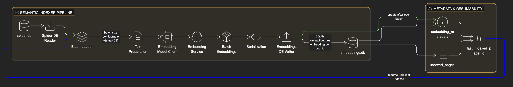

# Semantic Indexer

A resumable Go batch indexer that reads crawled pages from `spider.db`, generates normalized embeddings through the embedding service, and stores serialized vectors in `embeddings.db`.

## Architecture



**Flow:** `spider.db` -> Spider DB Reader -> Text Preparation -> Embedding Service -> Embedding Serialization -> `embeddings.db`

**Components:**

- **Indexer**: Orchestrates resumable batch processing and transaction boundaries
- **Spider DB Reader**: Reads pages from `spider.db` in ascending `id` order
- **Text Preparation**: Concatenates title, description, and truncated content into one embedding input
- **Embedding Model Client**: Sends batch requests to the Python embedding service
- **Serialization**: Converts `[]float32` embeddings into little-endian byte blobs
- **Embeddings DB Writer**: Stores one embedding per `doc_id` and tracks indexing metadata

## Usage

```bash
go run main.go
```

The indexer connects to `spider.db`, resumes from the last indexed page ID, processes pages in batches of 32, and writes results to `embeddings.db`. Use Ctrl+C to stop; rerunning resumes from the latest committed page.

## How It Works

**Indexing Strategy:**

- Reads total page count from `spider.db`
- Uses `indexed_pages` / metadata to resume after interruptions
- Loads pages after the last indexed ID in batches
- Builds embedding input from title + description + up to 2000 characters of content
- Calls the embedding service batch endpoint
- Serializes each embedding to a compact SQLite BLOB
- Saves the whole batch inside one transaction
- Updates `last_indexed_page_id` after each committed batch

**Resumability:**

- `indexed_pages` tracks which page IDs were committed
- `embedding_metadata` tracks progress keys such as `last_indexed_page_id` and `indexing_complete`
- Partial batches are not committed if a write fails

## Database Schema

**embeddings:**

- `doc_id` (primary key), `embedding`, `indexed_at`

**indexed_pages:**

- `doc_id` (primary key), `source_url`, `indexed_at`

**embedding_metadata:**

- `key` (primary key), `value`, `updated_at`

## Dependencies

- **Input**: `spider.db`
- **Output**: `embeddings.db`
- **External Service**: `embedding-service/` on `http://127.0.0.1:5000`
