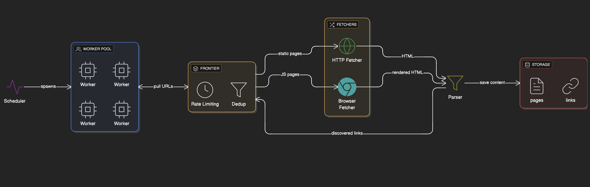
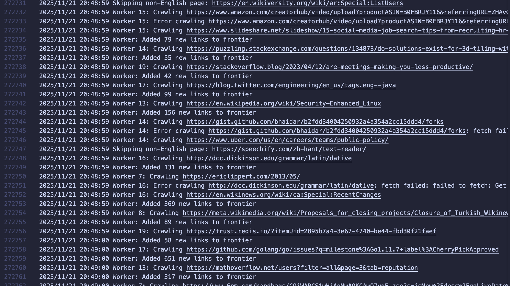
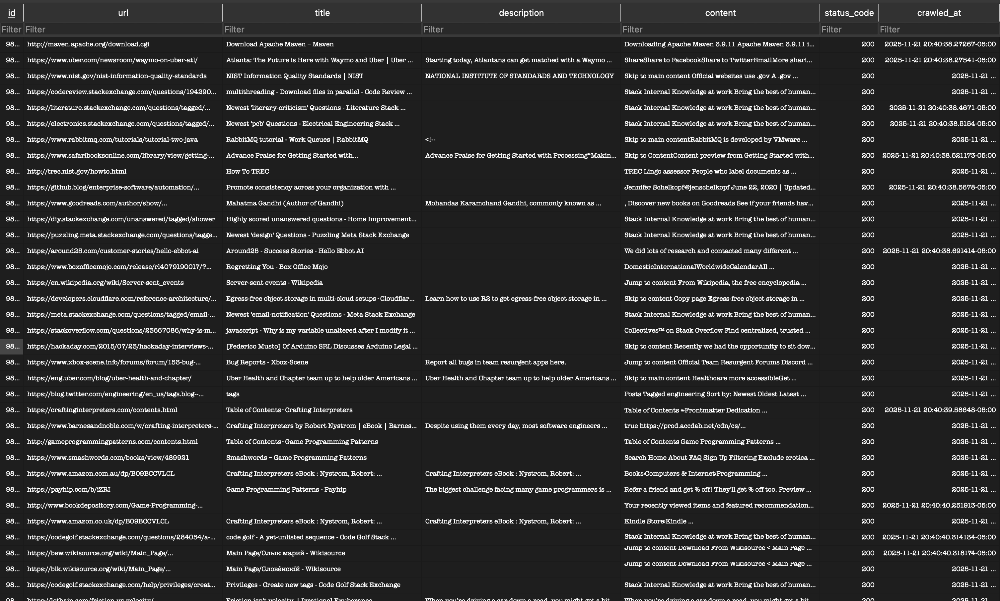

# Spider

A concurrent web crawler built in Go that crawls and indexes English web pages with per-domain rate limiting.

## Architecture



**Flow:** Scheduler -> Worker Pool -> Frontier (priority queue) -> Fetcher -> Parser -> Storage (SQLite)

**Components:**

- **Scheduler**: Orchestrates worker goroutines and tracks crawl progress
- **Frontier**: Thread-safe priority queue with per-domain rate limiting and duplicate detection
- **Fetcher**: HTTP client for downloading pages
- **Parser**: Extracts content, filters non-English pages, and normalizes links
- **Storage**: SQLite database for pages and link graph

## Configuration

```go
Workers:      20        // Concurrent crawlers
RateLimitSec: 1         // Seconds between requests per domain
MaxPages:     750000    // Max English pages to crawl
UserAgent:    "DeiSearchBot/1.0"
```

## Usage

```bash
go run main.go
```

The crawler loads previously crawled URLs from the database, adds seed URLs to the frontier, and spawns workers. It stops when MaxPages is reached or the frontier is empty. Use Ctrl+C for graceful shutdown.



## How It Works

**Crawling Strategy:**

- Breadth-first crawl starting from seed URLs
- Per-domain rate limiting using a min-heap priority queue
- Only English pages count toward MaxPages (detected via Content-Language header and HTML lang attribute)
- URLs are normalized (tracking parameters removed, fragments stripped)
- Non-HTML files (images, PDFs, videos) are skipped

**Rate Limiting:**
Each domain gets its own rate limit schedule. When URLs from the same domain are queued, they're assigned "available at" timestamps spaced by the rate limit duration. Workers automatically wait if the next URL isn't ready.

## Database Schema



**pages:**

- url (primary key), title, description, content, status_code, crawled_at

**links:**

- source_url, target_url (composite primary key)
